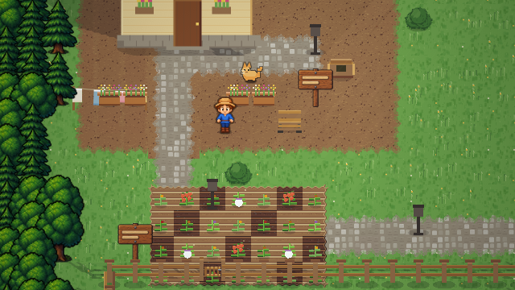
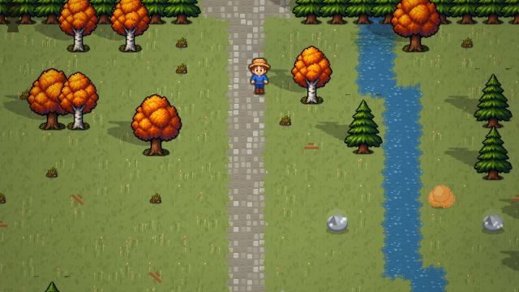
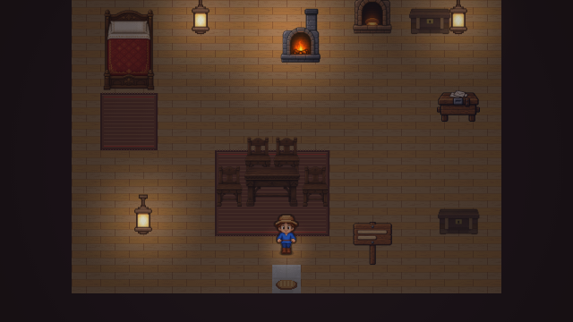
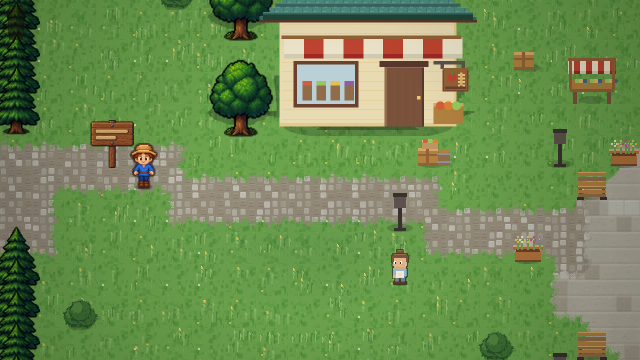
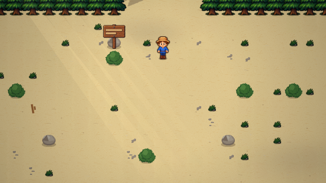

# 🏡 Fioralba — La Lanterna del Solstizio

Un gioco di fattoria *cozy* in italiano, vista dall'alto 3/4 (stile Stardew Valley),
che gira nel browser **senza installare niente**.

**Zero dipendenze e zero build**: si apre `index.html` e funziona. Tutti i suoni
sono sintetizzati con WebAudio, e quasi tutto quello che si vede è disegnato in
codice, pixel per pixel.

L'eccezione sta in `img/`: alberi, arredi, attrezzi e la camminata del contadino
sono **disegnati a mano**, a una densità che in codice non si riproduce. E sono
un'eccezione con la rete sotto — se quella cartella non arriva, il gioco ridisegna
l'arte in codice di sempre e resta giocabile.

---

## 📷 Com'è

| | |
|---|---|
|  |  |
| **Il podere.** Si zappa, si semina, si annaffia. Il gatto gira per i fatti suoi. | **Il bosco.** Alberi, cespugli e sassi cambiano con le quattro stagioni. |
|  |  |
| **Casa.** Il letto per dormire, i fornelli per cucinare, la scrivania per le lettere. I mobili si spostano. | **Il paese.** Sei abitanti con una giornata loro: a quest'ora Bruno è in bottega. |



*La costa: si pesca, e ogni mattina la marea lascia qualcosa sulla battigia.*

---

## ▶️ Come si gioca

**Il modo più semplice:** doppio clic su `index.html`.

**Se vuoi essere sicuro che i salvataggi funzionino** (alcuni browser bloccano il
salvataggio sulle pagine aperte da file locale), apri un terminale in questa
cartella e lancia:

```
python -m http.server 8123
```

poi vai su <http://localhost:8123> nel browser.

---

## 🛠️ Editor locale degli scenari

Per rifinire le mappe senza pubblicare l'editor, fai doppio clic sul file
corrispondente al tuo sistema operativo:

- **macOS:** `avvia-editor.command`
- **Windows:** `avvia-editor.bat`
- **Linux/Unix:** `avvia-editor.sh`

Il file avvia il server locale e apre automaticamente l'editor nel browser.
Serve Node.js con `npm` disponibile; per chi preferisce il terminale resta
disponibile `npm run editor`.

### Modalità modifica durante i test

Nell'anteprima di sviluppo compare anche **Menu → Sviluppo → Modalità
modifica**. È un banco di prova rapido, pensato per rifinire la scenografia
mentre si gioca:

1. apri la voce dal menu e tocca un albero, una panchina, una fioriera,
   un lampione o un altro arredo ambientale;
2. premi **Sposta**, poi tocca una casella libera; muri, porte, passaggi,
   acqua, campi e oggetti narrativi restano intenzionalmente protetti;
3. usa **Annulla** per l'ultima prova oppure **Azzera bozza** per ripartire;
4. scegli **Scarica bozza JSON** e apri il file nell'editor locale per la
   validazione e l'approvazione definitiva.

La modalità blocca i comandi normali e il salvataggio della partita. Alla
chiusura ripristina sempre la mappa: non pubblica scenari e non conserva
ritocchi nel salvataggio del giocatore. Funziona con mouse e tocco.

Il server la abilita automaticamente nell'anteprima Replit; in locale si può
avviare con `node server.js --sviluppo` oppure con
`FIORALBA_MODIFICA_INTERNA=1 npm start`. Una pagina aperta come semplice file
o un server statico generico non la abilita.

---

## 🎮 Comandi

| Tasto | Azione |
|---|---|
| **WASD** / **frecce** | Cammina |
| **Shift** | Corri |
| **Spazio** / clic sinistro | Usa l'oggetto che hai in mano |
| **E** / clic destro | Interagisci (porte, casse, macchine, persone) |
| **1…9** / rotellina | Cambia oggetto nella barra |
| **Q** | Getta l'oggetto in mano |
| — | il nome dell'oggetto in mano appare sopra la barra |
| **I** | Zaino e abilità |
| **C** | Banco da lavoro |
| **J** | Diario (obiettivi, abitanti, lettere) |
| **M** | Mappa della valle |
| **Esc** | Menu (audio, salvataggio) |
| **F** | Schermo intero |

**Serve un computer.** Fioralba è pensato per tastiera e mouse: da telefono o
tablet i comandi non funzionano come dovrebbero, e la pagina lo dice subito
invece di lasciartelo scoprire al primo clic.

---

## 👋 La prima volta

Alla **Nuova Partita**, dopo la lettera di Nonna Ilde, parte una **guida
interattiva**: ti prende per mano nelle prime azioni (muoviti, zappa, semina,
annaffia), illumina il pulsante giusto da premere e avanza quando fai la cosa
richiesta. Puoi saltarla in qualsiasi momento con *Salta guida*. Appare una volta
sola: chi ricarica una partita salvata non la rivede.

Finito il tutorial resta a schermo, in alto a sinistra, la lista dei **Primi
passi**: undici obiettivi che accompagnano dalla prima notte fino alla prima
brace del Santuario — dormi, raccogli, vendi, vai in paese, taglia un albero,
fai un regalo, pesca, esplora bosco e miniera, costruisci il ponte. Si spuntano
da soli guardando cosa hai fatto, quindi non ti obbligano a nessun ordine: se
peschi prima di dormire, si spunta la pesca. Il pannello si richiude cliccando
sulla testata e si può nascondere del tutto (poi torna da **Esc → Guida**).

Girando per la valle, quando hai davanti qualcosa di usabile compare in basso
un'indicazione di cosa fa **E**: *parla con Bruno*, *cassa di consegna*,
*bacheca delle richieste*, *ritira: Vino di Uva*. Prima bisognava indovinare
quali oggetti fossero interattivi.

E se una cosa non è chiara a parole, c'è da **guardarla**: in *Come si gioca*
(e sui passi della guida) quattro **scenette animate** mostrano il ciclo del
campo, il minigioco della pesca, come si carica una macchina e come funziona la
cassa di consegna. Non sono video: sono disegnate dal vivo con gli stessi sprite
del gioco, quindi pesano zero byte e non possono mostrare un'interfaccia vecchia.

## 📖 La storia

Tua nonna Ilde ti ha lasciato il podere. Sul testamento c'era scritto solo quello.

Nella prima lettera, però, ti scrive di una **lanterna nel bosco**, spenta da dodici
anni, che lei ha provato a riaccendere finché le mani gliel'hanno permesso.

Nella radura oltre il burrone c'è un santuario, e uno spirito di nome **Fiammella**
che ha quasi dimenticato il proprio colore. Per riaccendere la Lanterna del Solstizio
servono **quattro braci**, una per stagione: ognuna chiede i frutti di quel periodo
dell'anno.

Ogni brace accesa sblocca una nuova lettera di Ilde. Le lettere sono la vera storia.

> *"Non devi salvare la valle. Devi solo non abbandonarla oggi."*

Finita la storia il gioco **continua**: il podere resta tuo.

---

## 🌱 Cosa si può fare

**Coltivare** — Zappa la terra, semina, annaffia ogni giorno (se piove ci pensa il
cielo), raccogli a mani nude. 17 colture divise per stagione: chi semina fuori
stagione se ne accorge in fretta. Alcune ricrescono da sole, altre no.

**Espandere** — Dal fabbro Tobia si comprano **pollaio**, **serra** (dentro è sempre
estate), **silo** (più spazio nello zaino), **ponte del bosco** e **ampliamento
della casa**.

**Costruire e trasformare** — Barattoliera (conserve, valore ×2 +50), botte (vino e
succhi, ×3), forno per cucinare, fornace per i lingotti, arnie per il miele,
spaventapasseri, lanterne, staccionate, sentieri, casse.

**Guadagnare** — Vendi da Bruno oppure lascia la roba nella **cassa di consegna**
vicino a casa: viene ritirata di notte e pagata all'alba. Trasformare conviene
sempre più che vendere crudo.

**Migliorare** — Quattro abilità (Agricoltura, Raccolta, Estrazione, Pesca) che
salgono usandole: più resa, più energia massima, attrezzi più efficaci. Gli attrezzi
si potenziano in quattro stadi fino all'oro.

**Pescare** — Minigioco con barra da tenere sul pesce. 10 specie più il raro
**Pesce Luna**, che esce solo di notte. E qualche scarpa vecchia.

**Scavare** — La miniera rigenera i suoi minerali ogni notte: rame, ferro, oro,
quarzo, ametista, geodi e la Gemma di Luna.

**Fare amicizia** — Sei abitanti con gusti propri sui regali, battute che cambiano
col rapporto e dialoghi legati ai tuoi progressi. Marisol insegna ricette se passi
a trovarla.

---

## 🦌 La fauna

La valle è abitata. Le bestiole compaiono secondo l'ora, la stagione, il meteo e
il posto, e scappano se ti avvicini troppo.

| | dove e quando |
|---|---|
| **Coniglio** | prati del podere e del bosco, di giorno |
| **Cervo** | bosco, solo all'alba e al tramonto — raro e diffidente |
| **Scoiattolo** | bosco, di giorno, con la ghianda in mano |
| **Riccio** | di notte, cammina piano e non si spaventa quasi mai |
| **Rana** | vicino all'acqua |
| **Farfalla** | primavera ed estate, sei colori diversi |
| **Libellula** | estate, sopra l'acqua |
| **Uccellino** | ovunque di giorno, si posa e riparte |
| **Corvo** | podere — **ti becca il raccolto maturo** |
| **Pipistrello** | miniera |
| **Lumaca** | quando piove |

Il corvo è l'unico che ti dà fastidio: se hai colture mature e nessuno
**spaventapasseri** entro 6 caselle, scende e se ne mangia una. Con lo
spaventapasseri gira alla larga.

## 🌦️ Dettagli che potresti notare

- **Il vento è uno solo per tutta la valle**: erba, chiome, colture, panni stesi,
  tendoni del mercato, fumo dei camini e pioggia si piegano insieme, a folate
- **L'erba si scosta quando ci cammini in mezzo**
- I terreni non si toccano ad angolo retto: erba, terra, sentieri e sabbia
  **sconfinano l'uno nell'altro** con bordi irregolari
- Le aiuole arate prendono una forma unica con un piccolo argine attorno,
  invece di sembrare una griglia di quadrati
- **Le ombre girano con il sole**: lunghe e inclinate all'alba, corte a mezzogiorno
- Alberi ed edifici proiettano la loro sagoma vera, non un ovale
- Le stagioni cambiano il colore di erba e alberi; d'inverno la neve copre le chiome
- Petali in primavera, foglie in autunno, lucciole nelle notti d'estate
- Il fumo esce dai comignoli solo quando dentro è acceso, e lo porta via il vento
- Le finestre si illuminano al tramonto, i lampioni del paese si accendono da soli
- Di notte le luci hanno un alone morbido; raggi di sole obliqui all'alba e al tramonto
- La pioggia annaffia il campo e lascia gli anelli sulle pozzanghere
- Schiuma animata dove l'acqua tocca la riva
- L'acqua della fontana scorre, i panni stesi ondeggiano, il gatto ti segue
- Le colture pronte scintillano
- Le braci del santuario si accendono una per una, e la luce cresce ogni volta

---

## 💾 Salvataggi

Il gioco salva da solo ogni due minuti, quando dormi e quando chiudi la pagina.
Puoi salvare a mano da **Esc → Salva partita**.

Il salvataggio sta nel `localStorage` del browser: resta lì finché non cancelli i
dati del sito. Per ricominciare da zero basta **Nuova Partita**.

---

## 🛠️ Com'è fatto

Vanilla JS, canvas 2D, un file per argomento. **L'ordine degli script in
`index.html` conta**: `data.js` per primo, `game.js` per ultimo.

```
index.html          impalcatura e livelli dell'interfaccia
css/style.css       interfaccia in legno e carta

js/data.js          colture, oggetti, ricette, abitanti, agende, lettere, sagre
js/lingua*.js       i testi e la traduzione inglese
js/palette.js       i colori strutturali della valle, ritoccabili a caldo
js/art.js           gli sprite disegnati in codice, e la cache
js/immagini.js      carica l'arte disegnata a mano, e ripiega se non arriva
js/fx.js            vento, ombre proiettate, riflessi, contorni, colore
js/audio.js         musica generata (una per stagione) e suoni
js/world.js         le mappe, le collisioni, la rigenerazione notturna
js/mobs.js          fauna e prede

js/ui.js            il nocciolo dell'interfaccia: finestre, toast, dialoghi
js/partite.js       le partite sul server: codice, elenco, sincronia
js/diario.js        il Diario e la Mappa della valle
js/botteghe.js      zaino, negozio, banco, fornelli, fucina, Santuario
js/menu.js          impostazioni, «come si gioca», scenette animate
js/demo.js          le dimostrazioni del tutorial
js/landing.js       la pagina di presentazione
js/titolo.js        la scena animata dietro la schermata iniziale
js/changelog.js     cos'è cambiato, versione per versione

js/salvataggio.js   localStorage, backup, esporta/importa
js/sincronizza.js   il salvataggio sul server
js/pesca.js         il minigioco: lancio, abboccata, lotta
js/storie.js        la lezione di Oreste, la torta di Ilde, il Pesce Luna
js/vicende.js       le storie del paese
js/persona.js       zaino, resistenza, scarpe, cintura
js/solstizio.js     atto secondo: le memorie, la verità, la veglia
js/livelli.js       le cinque abilità e le carte di livello
js/traguardi.js     traguardi, Collezione del Naturalista, statistiche
js/abitanti.js      agende, cosa dicono oggi, passanti
js/paese.js         mercato, eventi notturni, bacheca, sagre, mercante
js/tutorial.js      la guida delle prime azioni
js/guida.js         «Primi passi»: gli obiettivi a schermo
js/tocco.js         i comandi per telefono e tablet
js/render.js        il disegno di un fotogramma
js/game.js          stato, ciclo di gioco, input, sistemi
js/debug.js         il pannello di prova

img/                l'arte disegnata a mano, e img/LEGGIMI.md che spiega
                    come si rimpicciolisce e a che misure

tsconfig.json       type-checking (solo editor e riga di comando)
types/fioralba.d.ts i tipi dei dati e dello stato
tools/coerenza.js   68 controlli su dati, mappe, misure e ordine di caricamento
server.js           serve il gioco (sviluppo e produzione: stesso file)
package.json        strumenti di sviluppo e avvio del server
```

Niente build, niente `npm install`: si aprono i file e funziona.

### Gli abitanti

Ogni personaggio, oltre ai colori, ha una **corporatura** (`esile`, `normale`,
`robusto`), una **statura** (da −2 a +3 pixel) e un **taglio di capelli**
(`corti`, `lunghi`, `crespi`, `raccolti`, `rado`). Sono in `js/data.js`, dentro
il `look` di ciascuno. Servono a distinguerli **dalla sagoma**: prima erano lo
stesso corpo ricolorato sei volte, e da lontano non si capiva chi fosse chi.

### Ritoccare i colori

Le tinte che definiscono l'aspetto della valle — terreni, acqua, corteccia,
ombre delle nuvole — stanno tutte in `js/palette.js`. Si possono provare dal
vivo, con la console del browser aperta sul gioco:

```js
PAL.applica({ sabbia: { base:'#c8a86a' } })
```

Le cache grafiche si svuotano da sole e la valle si ridisegna subito, senza
ricaricare la pagina. `PAL.esporta()` restituisce la tavolozza completa, da
incollare nel file quando una variante convince.

**Se ci metti mano**, prima di pubblicare conviene lanciare:

```
npm run verifica
```

Fa due cose: controlla i tipi (`tsc`) e verifica che i dati di gioco stiano in
piedi — che ogni ingrediente di ogni ricetta sia davvero ottenibile, che i semi
siano in vendita nella stagione giusta, che ogni mappa sia raggiungibile e che
nessun passaggio porti fuori dal mondo. Serve `npm install` una volta sola, e
riguarda solo chi sviluppa: per giocare non cambia niente.

**Perché nessuna libreria grafica.** Phaser o PixiJS avrebbero sostituito il
disegno su canvas, ma qui il collo di bottiglia non era *come* si disegna: era
*cosa* si disegna. Gli sprite sono tutti generati in codice, quindi il guadagno
vero stava nel migliorare l'arte e il renderer (raccordi fra terreni, ombre che
seguono il sole, bloom, vento condiviso), non nel cambiare il motore — che
avrebbe voluto dire riscrivere tutto senza aggiungere un pixel.

Il terreno viene pre-disegnato a blocchi di 8×8 caselle e riusato: un fotogramma
costa meno di **1 ms**, quindi resta fluido anche su macchine modeste.

---

## 🌐 Pubblicare

**Su Railway:** collega il repository e non c'è altro da configurare — Railway
trova il `package.json`, esegue `npm start` e serve il gioco. La porta la passa
lui nella variabile `PORT`, che `server.js` legge da sé.

**Altrove:** basta un Node qualsiasi. `npm start` e il gioco è servito.

> **Prima della pubblicazione:** avvia il server senza `--sviluppo` e senza
> `FIORALBA_MODIFICA_INTERNA=1`. In questo modo la Modalità modifica non viene
> autorizzata dal server, non compare nel menu e il suo pannello resta inerte.

In produzione `server.js` comprime i file, manda un `ETag` e lascia rivalidare
tutto: il browser tiene i file in cache e riceve un `304` finché non cambiano
davvero, così un aggiornamento non resta invisibile a nessuno. L'anteprima
social, che non cambia mai, ha una cache lunga.

> **Banda:** i suoni sono sintetizzati e la maggior parte degli sprite è disegnata
> in codice, quindi l'unico peso vero è `img/`, che sta sotto i due megabyte.

---

## 🔎 Sicurezza dei tipi (senza build)

Nel progetto c'è un `tsconfig.json` e un file di tipi `types/fioralba.d.ts`. Servono
**solo all'editor**: il browser non li carica, il gioco resta "apri e gioca".

Aprendo la cartella in **VS Code** ottieni subito:
- **autocompletamento** su tutto (scrivi `G.` o `DATA.CROPS.rapa.` e vedi i campi);
- **descrizioni** al passaggio del mouse sui dati e sullo stato di gioco;
- **controllo errori** attivabile file per file: aggiungi `// @ts-check` in cima a un
  file e VS Code ti segnala usi sbagliati (id inesistenti, campi mancanti, tipi
  errati). Un buon primo candidato è `js/data.js`.

I moduli grafici (ART, FX, REND, WORLD, MOBS…) sono lasciati volutamente "liberi":
tiparli in dettaglio darebbe poco valore rispetto al lavoro. I tipi si concentrano
dove gli errori costano di più — i **dati di gioco** e lo **stato**.

> Il controllo completo con `tsc` richiede Node installato (`npm run check`); non
> è necessario per giocare né per pubblicare, ma è utile se vuoi validare tutto in
> un colpo solo.

---

## 📜 Licenza

Fioralba è distribuito con licenza **[CC BY-NC-SA 4.0](LICENSE)**: puoi giocarci,
studiarlo, modificarlo e ridistribuirlo citando l'autore, ma **non venderlo**, e
le versioni derivate vanno rilasciate con la stessa licenza.
